# 인터넷 네크워크

## 인터넷 통신
### 인터넷에서 컴퓨터들은 어떻게 통신할까?
- 인터넷망을 통해서 데이터를 보냄.
  - 인터넷망이 결코 단순하지 않다.
  - 그래서 필요한 것이 IP!
## IP(Internet Protocol)
- 복잡한 인터넷망을 통해 데이터를 전달해야할 때 IP 주소를 부여받아 전달한다.
- 지정한 IP 주소(IP Address)에 데이터 전달
- 패킷(Packet)이라는 통신 단위로 데이터 전달
  > 패킷?   
package + bucket의 합성어
### IP 패킷 정보
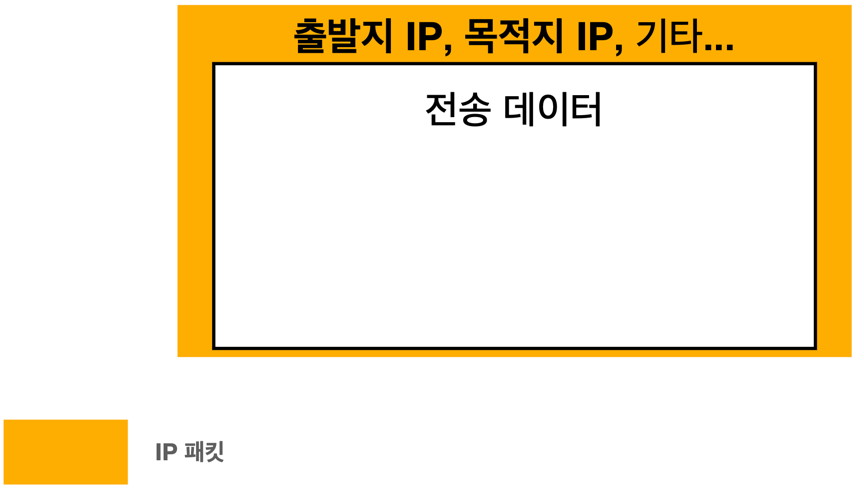
- 클라이언트와 서버에서 각각 인터넷망에 IP 패킷 정보를 담아서 던지면 데이터가 해당 정보에 따라 목적지까지 전달된다.
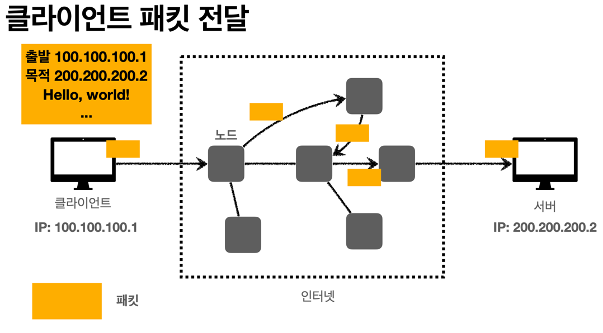
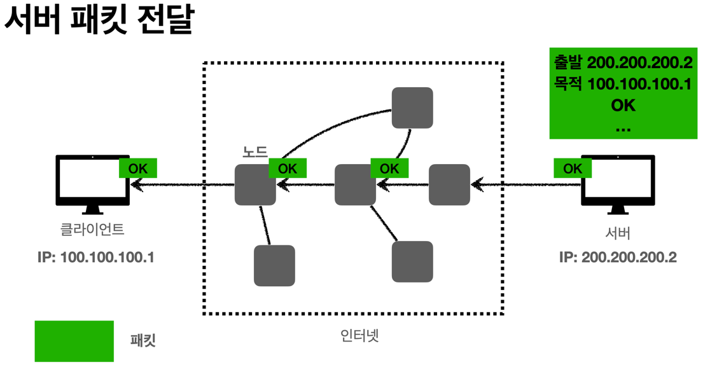
### IP 프로토콜의 한계
#### 비연결성
- 패킷을 받을 대상이 없거나 서비스 불능 상태여도 패킷 전송
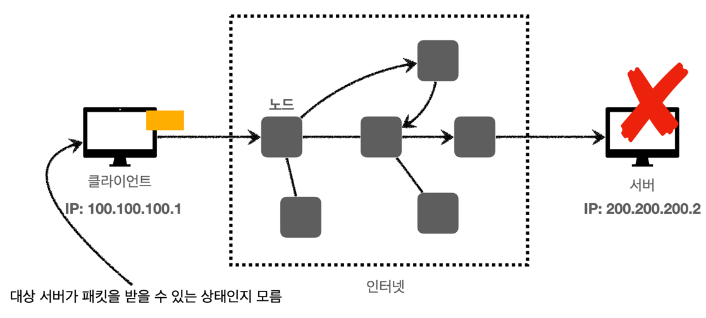
- 대상 서버가 데이터를 받을 수 있는 상태인지 몰라도 계속 통신을 시도한다.
#### 비신뢰성
- 패킷 소실 > 중간에 패킷이 사라지면?
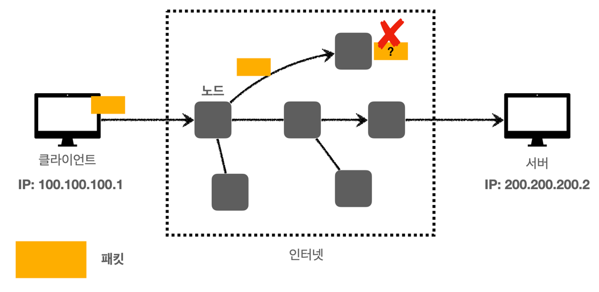
  - 데이터 전송 중 서버가 중단되면 패킷이 소실되지만 클라이언트는 이를 모른다.
- 패킷 전달 순서 문제 발생 > 패킷이 순서대로 안오면?
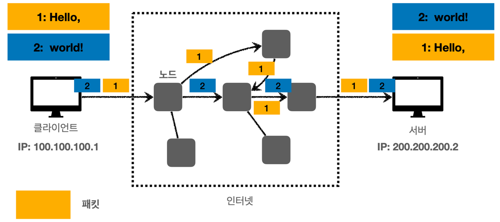
  - 한번에 통신해야하는 byte가 너무 많을 경우 나눠서 데이터가 전달되지만 진행되는 노드에 따라 순서가 다르게 전달될 수 있다.
  - 데이터를 전달하고자 하는 의도와 다르게 전달된다.
#### 프로그램 구분
- 같은 IP를 사용하는 서버에서 통신하는 애플리케이션이 둘 이상이라면?
## TCP, UDP
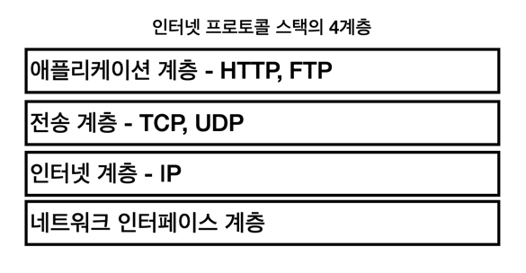
### TCP(전송 제어 프로토콜 = Transmission Control Protocol)
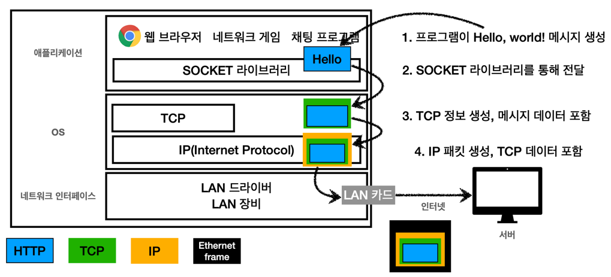
> IP 패킷이란   
실제로는 HTTP 데이터를 감싼(포함한) TCP 데이터를 감싼(포함한) 것

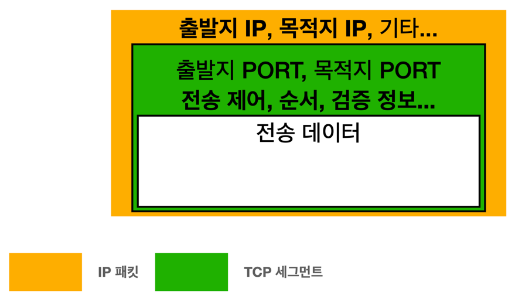
- TCP 세그먼트에 전송 제어, 순서, 검증 정보 등이 포함되어 있기 때문에 IP 프로토콜의 한계점이 어느정도 해소된다
#### 특징
- 연결지향 : TCP 3 way handshake(가상 연결)
  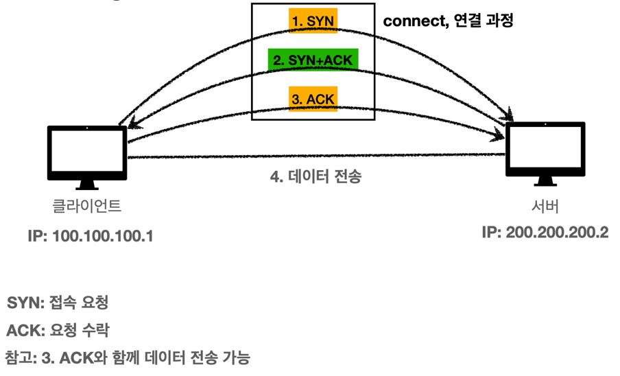
  - 데이터를 총 3번 주고 받으며 연결이 되었는지 확인하고 이후 데이터를 전달한다.
  - 대상 서버가 데이터를 받을 수 없는 상태라면 알 수 있다.
  - 비연결성 해소
  > 물리적인 연결이 아닌 논리적인 연결로 이해하기,,!
- 데이터 전달 보증
  - 데이터를 전송하면 전송이 잘 되었는지 응답이 옴
  - 비신뢰성(패킷 소실) 해소
- 순서 보장
  - 전달된 데이터의 순서가 다를 경우 잘못된 순서부터 다시 전달하도록 응답.
  - 비신뢰성(패킷 전달 순서 문제) 해소

- 신뢰할 수 있는 프로토콜
- 현재는 대부분 TCP를 사용함.
### UDP(사용자 데이터그램 프로토콜 = User Datagram Protocol)
- 하얀 도화지에 비유함 = 기능이 거의 없다.
- 연결지향 - TCP 3 way handshake X
- 데이터 전달 보증 X
- 순서 보장 X
- 데이터 전달 및 순서가 보장되진 않지만, 단순하고 빠르다.
> - IP와 거의 같지만 PORT, 체크섬(메세지가 맞는지 검증해주는 데이터) 정도만 추가된다.
> - 애플리케이션에서 추가 작업이 필요하다.
## PORT
- 하나의 IP 주소를 가진 클라이언트에서 둘 이상의 서버를 연결해야한다면?
  - PORT로 구분!
  - IP에 추가로 더해진 PORT
  - IP는 아파트, PORT는 동,호수
> 같은 IP 내에서 프로세스를 구분한다.

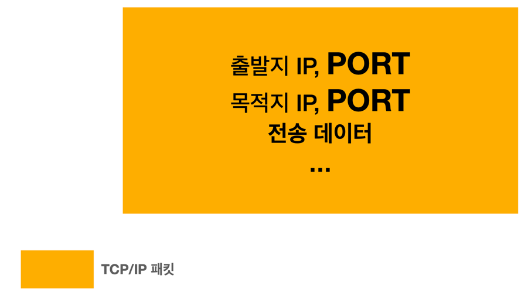

## DNS
- IP는 기억하기 어렵다는 단점이 있다.
- IP는 변경될 수 있다.
### DNS(도메인 네임 시스템 = Domain Name System)
- 전화번호부와 같은 역할
- 도메인 명을 IP 주소로 변환
- DNS 서버에 도메인과 IP 주소를 등록

---
[출처] [인프런 강의 :: 모든 개발자를 위한 HTTP 웹 기본 지식](https://www.inflearn.com/course/http-%EC%9B%B9-%EB%84%A4%ED%8A%B8%EC%9B%8C%ED%81%AC/dashboard)