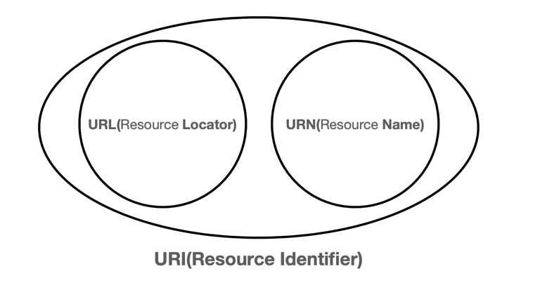
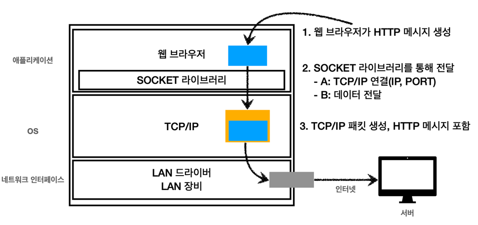

# URI와 웹 브라우저 요청 흐름
## URI(Uniform Resource Identifier)
- 리소스를 식별하는 통합된 방법
> URI? URL? URN?
> - URI는 locator(위치), name(이름) 또는 둘 다 추가로 분류될 수 있다.
> 
> - URL : Resource Location
>   - http://example.com:8042/over/there?name=ferret#nose
>   - scheme://authority/path?query#fragment
> - URN : Resource Name
>   - urn:example:animal:ferret:nose

### 단어의 뜻
- Uniform: 리소스를 식별하는 통일된 방식
- Resource: 자원, URI로 식별할 수 있는 모든 것 
  - 실시간 교통 정보 등 구분할 수 있는 모든 것
- Identifier: 다른 항목과 구분하는데 필요한 정보

### URL
- Locator
- 리소스가 있는 위치를 지정

### URN
- Name
- 리소스에 이름을 부여

> 위치는 변할 수 있지만, 이름은 변하지 않는다.
- 다만, URN 이름만으로 실제 리소스를 찾을 수 있는 방법이 보편화 되지 않음

> 앞으로 URI를 URL과 같은 의미로 이후 설명될 예정!

### URL의 전체 문법
#### scheme
- 주로 프로토콜 사용
> 프로토콜?
> - 어떤 방식으로 자원에 접근할 것인가 하는 약속 규칙
>   - http, https, ftp 등
- http는 80 포트, https는 443 포트를 주로 사용하며 포트는 생략 가능하다
- https는 http에 보안 추가

#### host
- 호스트명
- 도메인명 또는 IP 주소

#### port
- 포트
- 접속 포트
- 일반적으로 생략하지만 특정 서버에 따로 접근해야 할 때에는 입력하기도 한다.

#### path
- 리소스 경로, 계층적 구조
  - /home/file1.jpg
  - /members
  - /members/100, /items/iphone12

#### query
- key=value 형태
- ?로 시작, &으로 추가 가능
  - ?keyA=valueA&keyB=valueB
- query parameter, query string으로 불림
  - 웹서버에 제공하는 파라미터, 문자 형태(숫자를 입력해도 문자 형태)이기 때문
#### fragment
- 잘 사용하지는 않음
- html 내부 북마크 등에 사용
- 서버에 전송하는 정보는 아님

## 웹 브라우저 요청 흐름
- DNS 조회(IP와 PORT정보를 찾아냄)
- HTTP 요청 메세지를 생성
	- GET/search?q=hello&hl=ko HTTP/1.1
    Host:www.google.com

- 위 과정을 통해 서버 요청이 성공했다면 서버에서 동일하게 응답 패킷을 생성하여 HTTP 응답 메시지를 보내줌
- 웹 브라우저 HTML이 렌더링됨